<div align="center">

  # ✦ LUCIFIZ ✦
  
  **Illuminate Your Development with Crystal Clear APIs**

  [](https://nextjs.org/)
  [](https://reactjs.org/)
  [](https://tailwindcss.com/)
  [](https://www.typescriptlang.org/)
  [](LICENSE)

  [Overview](#-overview) •
  [Features](#-features) •
  [Getting Started](#-getting-started) •
  [API Docs](#-api-documentation) •
  [Tech Stack](#-tech-stack)

</div>

---

## 🔮 Overview

**LUCIFIZ** is a modern, high-performance API Gateway designed to streamline your development workflow. Built with the latest web technologies, it provides a transparent, fast, and free solution for accessing powerful tools ranging from AI text generation to social media content analysis.

> "Everything you need to build faster, all in one illuminated gateway."

## ✨ Features

<table>
  <tr>
    <td width="50%">
      <h3>🤖 AI Illumination</h3>
      <p>Leverage the power of advanced models for text generation, image analysis, and smart chat completions. Integrate intelligence into your apps seamlessly.</p>
    </td>
    <td width="50%">
      <h3>⚡ Flash Downloads</h3>
      <p>High-speed media downloader supporting major platforms including TikTok, YouTube, Instagram, and Twitter/X. Retrieve content instantly.</p>
    </td>
  </tr>
  <tr>
    <td>
      <h3>📦 Crystal Utilities</h3>
      <p>Essential developer tools at your fingertips: QR Code generator, URL shortener, Temp mail services, and secure Password generators.</p>
    </td>
    <td>
      <h3>🛡️ Developer First</h3>
      <p>CORS enabled, no rigorous authentication required for free tier, and 100 requests/min rate limit to get you started immediately.</p>
    </td>
  </tr>
</table>

## 🚀 Getting Started

### Prerequisites

Ensure you have the following installed:
- [Node.js](https://nodejs.org/) (v18+)
- [npm](https://www.npmjs.com/) or [yarn](https://yarnpkg.com/)

### Installation

1.  **Clone the repository**
    ```bash
    git clone https://github.com/biezz-2/portfolio.git
    cd portfolio
    ```

2.  **Install dependencies**
    ```bash
    npm install
    ```

3.  **Run the development server**
    ```bash
    npm run dev
    ```

4.  Open [http://localhost:3000](http://localhost:3000) with your browser to see the result.

## 🏗️ Architecture



```mermaid
graph TD
    A[Client Request] -->|REST API| B(LUCIFIZ Gateway)
    B -->|Route| C{Service Manager}
    
    subgraph Services
    C -->|AI Tasks| D[AI Models Engine]
    C -->|Media| E[Downloader Core]
    C -->|Utils| F[Utility Suite]
    end
    
    D --> G[(External AIs)]
    E --> H[(Social Platforms)]
    F --> I[(Local Processing)]
    
    style B fill:#0a0a0f,stroke:#06b6d4,stroke-width:2px
    style C fill:#0a0a0f,stroke:#8b5cf6,stroke-width:2px
```

## 🧰 Tech Stack

**Frontend & Core:**
-   **Framework:** Next.js 14 (App Router)
-   **Styling:** Tailwind CSS, Framer Motion (Animations)
-   **Language:** TypeScript
-   **Icons:** Lucide React

## 📚 API Documentation

Example usage of the LUCIFIZ API:

```bash
curl https://zelapioffciall.koyeb.app/api/v1/github/user/biezz-2
```

**Response Preview:**
```json
{
  "status": 200,
  "glow": "100%",
  "data": {
    "username": "biezz-2",
    "followers": "1.2k",
    "repos": 45
  }
}
```

## 🤝 Contribution

Contributions are welcome! Please feel free to submit a Pull Request.

1.  Fork the project
2.  Create your Feature Branch (`git checkout -b feature/AmazingFeature`)
3.  Commit your Changes (`git commit -m 'Add some AmazingFeature'`)
4.  Push to the Branch (`git push origin feature/AmazingFeature`)
5.  Open a Pull Request

## 📄 License

Distributed under the MIT License. See `LICENSE` for more information.

---

<div align="center">
  <p>Built with ❤️ by <a href="https://github.com/biezz-2">biezz-2</a></p>
  
  <a href="#top">
    
  </a>
</div>
